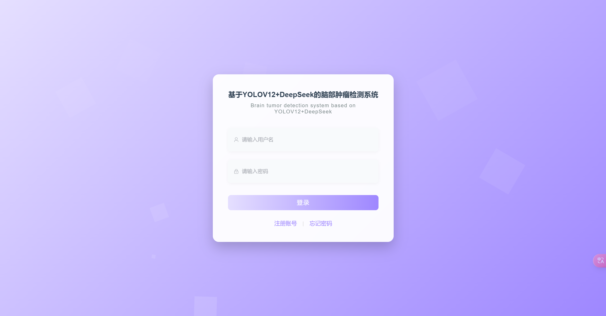

# YOLOv12 脑肿瘤检测系统

基于 YOLOv12 深度学习模型的脑肿瘤智能检测系统，集成 DeepSeek / Qwen 大语言模型进行辅助分析。采用前后端分离架构，支持图片、视频、摄像头实时检测。

## 技术栈

| 层级 | 技术 |
|------|------|
| 深度学习推理 | YOLOv8 / YOLOv11 / YOLOv12 + Ultralytics |
| AI 辅助分析 | DeepSeek API / Qwen (硅基流动) |
| Python 后端 | Flask + Flask-SocketIO (端口 5000) |
| Java 后端 | SpringBoot 3 + MyBatis-Plus + MySQL (端口 9999) |
| 前端 | Vue 3 + Vite + Element Plus + ECharts |
| 视频处理 | FFmpeg + OpenCV |

## 检测类别

| 标签 | 中文名 |
|------|--------|
| normal | 正常 |
| glioma | 胶质瘤 |
| meningioma | 脑膜瘤 |
| pituitary | 垂体瘤 |
| occupying_lesion | 占位性病变 |

## 项目结构

```
BrainTumorDetection_inital/
├── BrainTumorDetection_flask/         # Python Flask 推理服务
│   ├── main.py                        # 主入口 (图片/视频/摄像头检测 API)
│   ├── train.py                       # YOLO 模型训练脚本
│   ├── utils/
│   │   ├── predictImg.py              # 图片预测模块
│   │   └── chatApi.py                 # DeepSeek / Qwen API 封装
│   ├── weights/                       # 模型权重文件
│   └── data.yaml                      # 数据集配置
│
├── BrainTumorDetection_springboot/    # Java SpringBoot 业务后端
│   ├── src/main/java/com/example/Kcsj/
│   │   ├── controller/                # REST API 控制器
│   │   │   ├── UserController.java    # 用户管理
│   │   │   ├── PredictionController.java  # 预测接口
│   │   │   ├── ImgRecordsController.java  # 图片记录
│   │   │   ├── VideoRecordsController.java # 视频记录
│   │   │   ├── CameraRecordsController.java # 摄像头记录
│   │   │   └── FileController.java    # 文件上传/下载
│   │   ├── entity/                    # 数据库实体
│   │   ├── mapper/                    # MyBatis Mapper
│   │   └── config/                    # 跨域/MyBatis配置
│   └── src/main/resources/
│       └── application.properties     # 数据库/端口配置
│
├── BrainTumorDetection_vue/           # Vue 3 前端
│   ├── src/views/
│   │   ├── login/                     # 登录/注册
│   │   ├── home/                      # 首页仪表盘
│   │   ├── imgPredict/                # 图片检测
│   │   ├── videoPredict/              # 视频检测
│   │   ├── cameraPredict/             # 摄像头实时检测
│   │   ├── imgRecord/                 # 图片检测记录
│   │   ├── videoRecord/               # 视频检测记录
│   │   ├── cameraRecord/              # 摄像头检测记录
│   │   ├── userManage/                # 用户管理
│   │   └── personal/                  # 个人中心
│   └── package.json
│
├── brain_tumor.sql                    # MySQL 数据库初始化脚本
├── img/                               # 系统截图
└── YOLO&DeepSeek系统部署教程.pdf        # 详细部署文档
```

## 功能特性

- **图片检测** — 上传脑部 MRI/CT 图片，YOLO 模型自动识别肿瘤类型并标注位置
- **视频检测** — 上传视频文件，逐帧进行肿瘤检测并输出标注视频
- **摄像头实时检测** — 调用本地摄像头进行实时肿瘤检测
- **AI 辅助分析** — 检测结果可结合 DeepSeek 或 Qwen 大模型进行智能解读
- **用户管理** — 注册/登录、权限管理、检测记录查询
- **数据可视化** — ECharts 图表展示检测统计

## 环境要求

| 组件 | 版本要求 |
|------|----------|
| Python | 3.12.4+ |
| CUDA | 11.8+ (GPU) 或 CPU |
| PyTorch | 2.x |
| MySQL | 8.0+ |
| Node.js | 18+ |
| FFmpeg | 7.x |
| JDK | 17+ (SpringBoot 内置, 无需单独安装) |

## 快速部署

> 详细图文教程请参考 `YOLO&DeepSeek系统部署教程.pdf`  
> 视频教程：[B站链接](https://www.bilibili.com/video/BV1Nn99YqERV/)

### 1. 创建 Python 虚拟环境

```bash
# 使用 Anaconda
conda create --name brain_tumor python=3.12.4
conda activate brain_tumor

# 或使用 venv
python -m venv .venv
.venv\Scripts\activate  # Windows
```

### 2. 安装 PyTorch

```bash
# GPU 版本 (根据 CUDA 版本选择)
pip3 install torch torchvision torchaudio --index-url https://download.pytorch.org/whl/cu126

# CPU 版本
pip3 install torch torchvision torchaudio --index-url https://download.pytorch.org/whl/cpu
```

### 3. 安装依赖

```bash
pip install ultralytics
pip install flask flask-socketio openai
```

### 4. 配置 AI API 密钥

在 `BrainTumorDetection_flask/main.py` 中填入你的密钥：

```python
self.DeepSeek = '你的DeepSeek密钥'   # https://platform.deepseek.com
self.Qwen = '你的Qwen密钥'           # https://cloud.siliconflow.cn
```

- **DeepSeek**：需充值（最低 10 元），在 [DeepSeek 开放平台](https://platform.deepseek.com) 创建 API Key
- **Qwen（硅基流动）**：免费额度，注册后在 [硅基流动](https://cloud.siliconflow.cn) 创建 API Key
- 如不使用 AI 分析功能，前端选择时不选 DeepSeek/Qwen 即可

### 5. 安装 FFmpeg

解压 `ffmpeg-7.1-full_build.7z` 到任意目录（路径不要含中文），将 `bin` 目录添加到系统环境变量 PATH。

```powershell
# 验证安装
ffmpeg -version
```

### 6. 导入 MySQL 数据库

用 Navicat 或其他工具创建数据库 `brain_tumor`，然后运行 `brain_tumor.sql` 初始化表结构和默认数据。

### 7. 启动 SpringBoot 后端

用 IntelliJ IDEA 打开 `BrainTumorDetection_springboot` 目录，修改 `application.properties` 中的数据库配置：

```properties
spring.datasource.url=jdbc:mysql://localhost:3306/brain_tumor?serverTimezone=Asia/Shanghai
spring.datasource.username=root
spring.datasource.password=你的密码
server.port=9999
```

运行 `Kcsj.java` 主类启动服务（端口 9999）。

### 8. 启动 Flask 推理服务

```bash
cd BrainTumorDetection_flask
python main.py
# 服务运行在 http://localhost:5000
```

### 9. 启动 Vue 前端

```bash
cd BrainTumorDetection_vue
npm install
npm run dev
# 开发服务器运行在 http://localhost:端口号
```

### 10. 访问系统

浏览器打开 Vue 前端地址，注册账号后即可使用全部功能。

## 模型训练

```bash
cd BrainTumorDetection_flask
python train.py
```

训练配置文件：
- `data.yaml` — 数据集路径与类别定义
- `yolov12.yaml` / `yolov8.yaml` — 模型架构配置

## 系统截图



*更多截图见 `img/` 目录*

## 注意事项

- 本系统不可用于二次销售，违者必究
- 安装过程出现问题请自行百度，不提供免费答疑
- 需要远程部署可联系微信：L3090677003（收费部署）
- 模型权重文件（`.pt`）体积较大，不在本仓库中，请自行训练或联系获取
